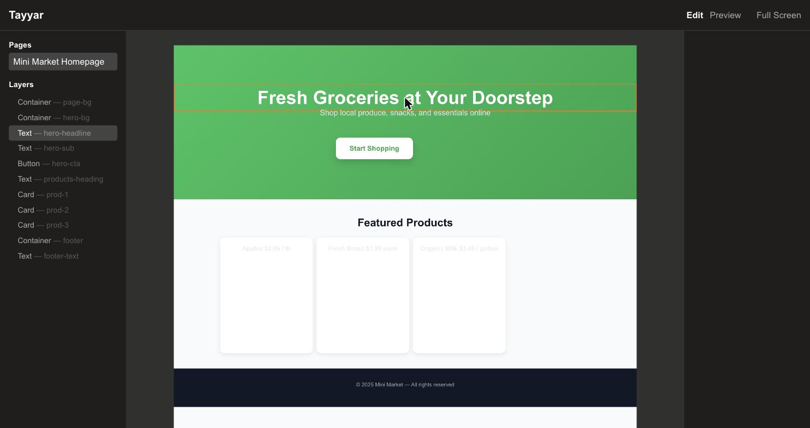

# Tayyar

**A visual page builder where sections lay themselves out.**



---

## The problem

Page builders make you place every box by hand. Templates hand you one look you cannot reshape.

Neither of them knows what a *header* is. To the builder it's a row of rectangles, so making it work
on mobile means moving all of them again — and again for tablet. The design decisions that actually
matter ("this is a marketplace, search should dominate, keep it tight") live in your head, and every
layout has to be re-derived from them by hand.

## The solution

Describe the section by **intent** instead:

```ts
{ styleIntent: 'marketplace', searchEmphasis: 'dominant',
  density: 'tight', desktop: 'search-dominant', mobile: 'overlay-search' }
```

A layout module turns that into real positions on a 12-column grid — for every breakpoint. The
output is an ordinary component tree, so you can still select anything on the canvas and drag it.

## How it works

**Everything is one JSON tree.** A `UIComponent` has a whitelisted `type`, a `props` bag, `x/y/w/h`,
and `children`. Nothing else. Pages are arrays of those.

**Layout is a pipeline of pure functions.** `runSectionPipeline` walks an ordered list of section
modules, each one a `(roots: UIComponent[]) => UIComponent[]` transform over a fresh deep clone. A
module can rewrite the whole tree, and because it is pure you can re-run the pipeline on every render
— which is exactly what the canvas does.

**The intent vocabulary is typed.** `header/spec.ts` is 389 lines of unions — theme, density, style
intent, search emphasis, per-breakpoint modes, action types, style packs — and `layoutHeaderSmart.ts`
is 674 lines turning that into coordinates. The spec is the interesting part: it makes the design
decisions explicit and reviewable instead of implicit in the pixel positions.

**The grid is real.** 1200px canvas, 1184px container, 12 columns with 16px gutters, plus a
24-subcolumn nudge grid for finer alignment.

## Status

Runs on bundled mock pages — clone it, `npm run dev`, and you get the builder in the screenshot.

Working: canvas with drag/resize and grid snapping, layers tree, selection, edit/preview/full-screen,
and the section pipeline.

Designed but not wired up:

- **LLM generation** — `pages/api/generate.ts` is commented out. The component schema was built to be
  model-emittable and the full prompt contract is written out in `lib/generateCode.ts`, but nothing
  calls it.
- **Code export** — `lib/generateCode.ts` is that contract as comments; there is no executable code
  in the file yet.
- **Style editor** — `RightSideBar/StyleEditor.tsx` exists and converts style edits to Tailwind
  classes, but it is not mounted in `pages/index.tsx`, so the right panel is currently empty.

## Run it

```bash
npm install
npm run dev        # http://localhost:3000
```

Click the page under **Pages** to load it, then click anything on the canvas to select it.
